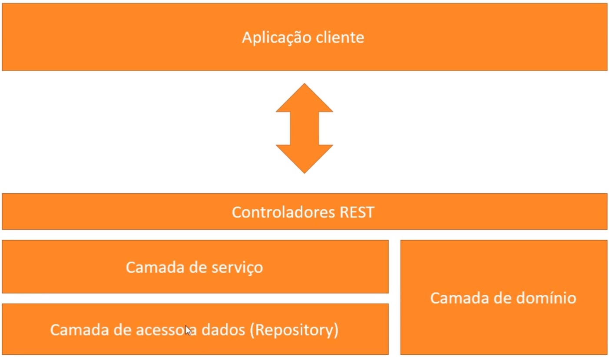
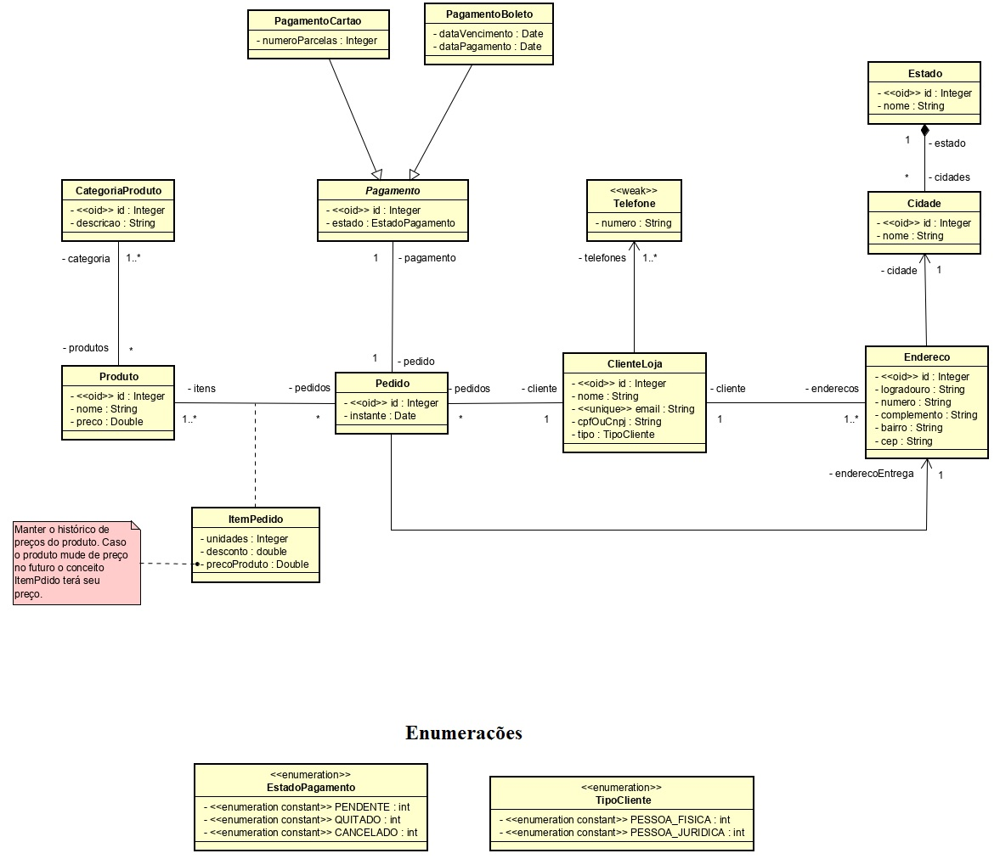

# Modelagem de uma loja utilizando UML

## Sobre a modelagem

#### Tecnologias envolvidas

 - Spring Boot
 - JPA
 - Hibernate
 - Apache MAVEN
 - DB em mémoria com H2
 
#### Descrição da arquitetura 

O sistema foi desenvolvido em camadas. Temos a camada ```Controladora REST``` representada no pacote ```br.com.rodolfo.loja.resources```, a camada de ```Domínio (Models)``` representada no pacote ```br.com.rodolfo.loja.domain``` e as camadas de  ```Serviço``` e  ```Repositório (Repository ou DAO's)``` representadas nos pacotes ```br.com.rodolfo.loja.services``` e ```br.com.rodolfo.loja.respositories``` respectivamente. A figura abaixo sumariza a arquitetura.



#### Descrição do diagrama
 
O diagrama da aplicação pode ser visualizado na imagem abaixo. 

